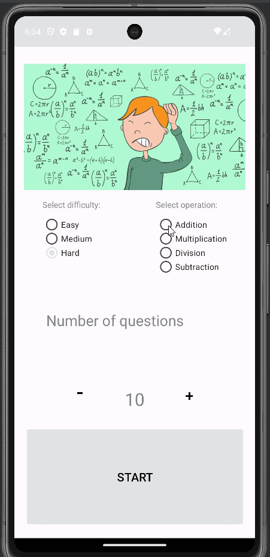

# Project 3: Arithmetic Practice
An Android app for an arithmetic practice game, for C323 Android Mobile Development.
It has 3 difficulties: Easy, Medium, and Hard.
It has 4 operations: Addition, Subtraction, Division, and Multiplication.

## Functionality 

The following **required** functionality is completed:

* [ ] User can choose a difficulty
* [ ] User can choose an operation type
* [ ] User can choose the number of questions
* [ ] User can enter and submit their answer to each question
* [ ] User can see their total score of correct answers at the end
* [ ] User can press a button to play again

The following **extensions** are implemented:

* I added some code so that the user could do decimal math for division, but left it commented out for now.

## Video Walkthrough

Here's a walkthrough of implemented user stories:

GIF created with [LiceCap](http://www.cockos.com/licecap/).

## Notes

This was my first time using the navigation and fragment system. It took a while, but I'm glad I got it to work.

## License

    Copyright [2023] [Billy Moore]

    Licensed under the Apache License, Version 2.0 (the "License")
    you may not use this file except in compliance with the License.
    You may obtain a copy of the License at

        http://www.apache.org/licenses/LICENSE-2.0

    Unless required by applicable law or agreed to in writing, software
    distributed under the License is distributed on an "AS IS" BASIS,
    WITHOUT WARRANTIES OR CONDITIONS OF ANY KIND, either express or implied.
    See the License for the specific language governing permissions and
    limitations under the License.
